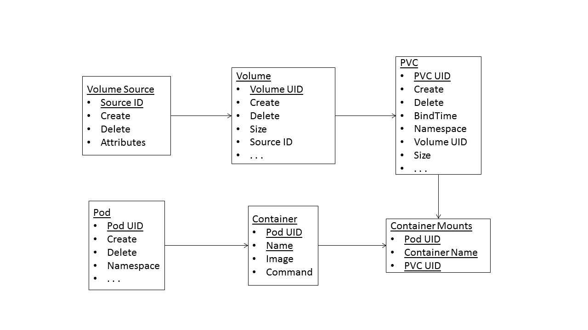

Motivation
----------

Kubernetes does much to make storage easy to consume:  the persistent volume
interface allows users to request and claim storage automatically, a capability
that the advent of dynamic provisioning will only further.  However, although
it helps remove some of the busywork from the storage administrator's role,
it also deprives them of valuable information.  Because volumes will be consumed
and, eventually, generated without administrators' involvement, they
will have little sense of how the underlying storage is actually
used, making long-term management and hardware provisioning decisions more
difficult than they need to be.

Ironically, though, this need not be the case.  Kubernetes currently tracks
everything needed to answer questions about usage--volumes, the backend
storage they point to, and the applications run in the pods that mount
the volumes--it just does not make it easy to query this data or provide
any historical information.  Thus, for instance, if an administrator wants
to figure out which containers are currently using a given PVC, she must
iterate through all of the containers in that PVC's namespace.  Similarly,
if she is presented with a released volume, she has no way, short
of poring over the volume's contents, to tell how the volume was used.

We propose remedying these deficiencies with a volume usage tracker,
a companion component to Kubernetes that records volume usage data for
querying and analysis.  The volume tracker aims to answer questions like the
following:

* How much space is a given user consuming?
* Which users are using a specific volume?
* Which applications are running on a given volume?

In addition to these questions about the immediate state of the cluster, it
also seeks to enable investigation into long-term storage activity, providing
answers to questions like:

* What storage has a group of users interacted with in the past thirty days?
* For how long has a currently unused volume been unused?
* Has the set of applications accessing a given volume changed over time?
* Has the frequency with which new volumes are created changed over time?

Because the volume tracker would lie outside the critical path for cluster
operations and because it would likely have dependencies on external data stores
other than etcd, we anticipate that this work would belong in the contrib
repository.

In the remainder of this document, we first propose a data model for the usage
tracker that would allow us to address the queries we seek to answer.  We then
examine the existing structures in the Kubernetes ecosystem that provide similar
functionality to usage tracking and investigate how they fall short of our
goals.  Following this, we propose a preliminary design and several
implementation options and describe the status of our current investigatory
prototype.  We conclude with a brief discussion of some of the open issues
in this area.

Data Model
----------

Implementing usage tracking for storage requires that we monitor and persist
data about pods, PVCs, and PVs.  In addition, for completeness, we also should
store data about individual containers and the backing stores used for PVs.
We envision the underlying data to follow the following schema:

Arrows indicate one-many relationships and identifiers are underlined.  In
most cases, we anticipate using the Kubernetes UID as the unique identifier
of each object.  In the case of containers, the combination of the
pod UID and the container name uniquely identifies a container (even if the
internal primary key differs); for volume sources, an opaque, autoincrementing
ID should suffice, although different attributes based on the type of backend
can be used.  Ellipses indicate places where we could add additional attributes,
based on the types of queries we ultimately want to answer.

Note that volume source encompasses multiple possible volume backends (e.g.,
EBS, GCEPersistentDisk, NFS, iSCSI, etc.), each of which would likely have its
own table with its own set of attributes.  It may suffice to simply have each
table consist of the attributes used in the backend specification (e.g., an
NFS volume source would have IP address and path attributes), but it may be
better to have organizations define volume sources manually, using
higher-level information (e.g., in practice, several NFS specifications with
different paths may all resolve to the same volume); this remains an open
question.

There are two important points regarding this schema.  First, it is
highly relational, with no one-one relationships and a many-many relationship
between containers and PVCs.  Second, most of the tables have many
attributes--potentially as many as are present in the spec for each
corresponding Kubernetes objects.  Thus, joins will be prevalent through many
of our queries and, due to the large number of attributes, denormalization is
unlikely to be a workable solution.  In addition, as we implement this, we will
need to decide which portions of the spec for each object type should be made
attributes in the table and which, if any, we can afford to store as opaque
JSON.

Existing Solutions
------------------

Initially, it may appear that Kubernetes already has the facilities with which
to address the questions we wish to examine.  Etcd provides a view of the
current state of the cluster, and both cAdvisor and Heapster provide historical
views of resource usage throughout the cluster.  However, none of these
solutions is ultimately suited to our purpose.

The etcd registry seems like the most obvious fit for our goals.  Kubernetes
already uses
it to store PVs, PVCs, and pods, and by examining their entries, one can
infer the relationships between storage objects and containers.  Despite this,
the registry has several key shortcomings.  First, etcd only exports a key-value
interface,
causing targeted queries to require traversing large portions of the key-space,
which may be slow for large deployments.  Second, the links between the objects
stored in the registry are currently only partial, which can lead to
inconsistent
results, especially given etcd's lack of transactional semantics.  For
instance, pods only store name references to the PVCs they mount;
in cases with substantial PVC churn, a query for the PVC of that name may not
return the correct PVC, if that PVC was destroyed and another was created with
the same name.  Finally, with the exception of the event log, the registry only
tracks current cluster state, making it impossible to answer queries about
the historical state of the cluster, as described earlier.  While some of these
deficiencies can be overcome--the second issue could be dealt with by making
object links fully bidirectional, at the cost of occupying additional space and
complicating binding semantics--others cannot.  In particular, the limitations
that etcd has on data set size and the inability to execute point queries on
attributes other than the key make keeping historical records in etcd
infeasible.

On the other hand, both cAdvisor and Heapster, monitoring projects designed
for nodes and clusters, respectively, support long-term historical usage
tracking, using backends like InfluxDB for persistence.  Although the metrics
gathered by these tools can usefully complement the data we propose to gather,
the tools currently do not collect the information we need.  Adding this
capability would not be an natural extension; these tools currently gather
numeric time series data, which is far removed from the heavily relational,
descriptive data we seek to catalog.  Thus, while we could integrate this
functionality into either of these tools, it would be a fairly heavyweight
addition, likely requiring the addition of a new backing store, and the shape
of our solution would be unlikely to change.

Design and Implementation
-------------------------

Given that the current monitoring infrastructure around Kubernetes does not
support our goals, we propose implementing usage tracking as a two-part
component, consisting of a monitor process that watches the API server for
changes in the cluster's use of storage and a backing store which records
the cluster state as it evolves.  Both of these parts should be deployable
as single instance, containerized daemons.

Of the two pieces of the volume tracker, the monitor is the most
straightforward.  It needs to keep watches on the API server for PVs, PVCs, and
pods; to infer the state of cluster storage based on the incoming watch data;
and to persist this state in the backing store.  Setting the watches requires
little machinery beyond what currently exists in Kubernetes and can be done with
standard libraries.  The implementation of the other aspects of the
monitor--determining the cluster state and persisting it--will depend heavily
on the backing store chosen and its capabilities.

Backing Store Options
=====================

A variety of potential approaches exist for the backing store, ranging from
basic log-like approaches to RDBMSes to graph stores.  In general, most of these
trade off work done in the initial persistence layer for ease of querying later.
This section will cover some of these approaches and their ramifications.

**JSON+Elasticsearch**:

The easiest approach for implementing persistence would be to simply dump the
incoming data from the monitor's watches into Elasticsearch without further
processing.  In addition to speeding ingest, this would allow users to query
freely on all parts of each JSON object; the implementation would not have
to anticipate the important attributes and pull them into a predefined schema.
However, elasticsearch's querying capabilities are too restrictive to address
many of the basic queries we are targeting.  In particular, its difficulty
in selecting based on more than one attribute and its inability to
perform joins or to do range queries based on values taken from a queried-for
object (e.g., which pods were started after the creation of a PVC but before
its destruction) make it ill-suited for our purposes.  Although the
monitor could preprocess the data to alleviate some of these issues, the
introduction of preprocessing removes or mitigates the biggest advantages of
this approach--monitor simplicity and speed and, to a lesser extent, the
ability to query over arbitrary fields--encouraging one of the alternate
approaches.

**RDBMS**:

Given the relational nature of the data and the high volume of attributes
present in it, a traditional RDBMS, such as MySQL or Postgres, may work well.
Using this approach, the schema outlined previously would translate directly
into database tables.  The monitor would then translate the events that it
receives from its watches into `INSERT` and `UPDATE` statements into the
database, as appropriate.

This approach places most of the responsibility
for ensuring view consistency into the monitor; when inserting mappings from
containers to PVCs, for instance, it will need to find the PVC matching the
name given in the container that was created most recently before the
container's start time.  Similarly, the monitor must also account for asynchrony
between watch event arrivals; it may, for instance, process a bind event for
a persistent volume before it sees the claim to which the PV is bound.  Meeting
these demands requires either the monitor to do significant preprocessing and
state maintenance before inserting database records or for the backing database
to support transactions.  Of these two approaches, transactions would be the
easiest to implement; however, performance may eventually prove problematic.

The largest caveat with this approach, however, is scalability.  Large clusters
may generate significant amounts of data, and it is unclear whether a
traditional RDBMS would be able to hold up under that degree of load.
Potentially, we could turn to a NoSQL store, instead, but it is unclear if
any would be able to both support joins and a relatively high rate of ingest.

**Graph Database**:

Graph databases, with their ability to capture complex networks of relations
between entities, could be a viable alternative to an RDBMS.  Many of the
implementation issues would likely be similar--asynchrony is still a problem,
and horizontal scaling may remain a challenge--and some of the characteristics
of our data set may be ill-suited for graph DBs--the schema is known and
largely fixed, and, while there are a number of associative relationships, it
is unclear if these are complex enough to really benefit from a graph DB.
On the other hand, if join performance proves problematic, a graph DB would
likely work better than an RDBMS, and it may prove better at scaling on a single
node.

Current Status
==============

We have implemented a small prototype of this system, backed by
a containerized MySQL RDBMS.  It relies on MySQL to do the heavy-lifting for
handling asynchrony:

* The monitor effectively maintains no state and serves only to translate
  watch events into database updates.  It maintains separate threads for each
  watched resource type; these threads do not communicate.
* Most database changes use MySQL's `INSERT OR UPDATE` functionality, regardless
  of whether they reflect the addition of a new resource or an update to an
  existing one.  This allows the volume tracker to persist data from events that
  affect multiple resources, such as binding, without having registered the
  creation of all affected resources first.
* Most database changes are wrapped in transactions to ensure atomicity across
  the different resource types.

The prototype uses the schema shown earlier, tracking the attributes listed and
storing the JSON for the first watch event seen for each resource, as well.
It currently tracks the following events:

* Pod creation and deletion
* PV creation and deletion
* PVC creation and deletion
* PV-PVC binding

The volume source table is populated by examining the volume spec in each PV
and creating a database entry for that.  We currently only support NFS and
assume that volumes with the same IP address but different paths are separate
sources, even if one is actually a subdirectory of the other.

The monitor populates the container-mount table upon pod creation, examining
the PVC names (if any) referenced in each container.  It then retrieves the
most recent PVC created and not deleted for each name and, if one exists,
inserts the PVC UID and name into the table; if not, it just inserts the PVC
name.  When the monitor receives a PVC insertion event, it updates any
container-mount entries that match its name whose pods were created after
the PVC.  Although this means that, for a time, some pods and containers will
be associated with the wrong storage, because PVC events arrive in strict
temporal order, the system will converge upon the correct state.  Because
Pod objects only ever reference PVC names and not UIDs, it is impossible to do
better than the eventual consistency that this method provides.

Note that this implementation assumes that users delete pods, PVCs, and PVs
only when they are not currently in use.  Given that deleting in-use objects
leads to undefined behavior in the cluster, this assumption seems reasonable.

Open Issues
-----------

This implementation works, but a number of questions remain.  The largest is
performance; it is currently unknown if this approach will be able to handle
the volume of updates in a busy, production-scale cluster.  The transactional
machinery that the current prototype uses to handle consistency issues may prove
too expensive, and it may be necessary to use a graph DB to speed up lookups
(especially for populating the container mount table) or to shift much of the
logic to the monitor itself.

In addition, the schema and the events tracked are by no means complete.  While
we provide adequate data to answer the questions proposed in the Motivation
section, there may well be other questions for which the current data tracked
does not suffice.  Determining what the volume tracker needs to record is
one of the major purposes of this proposal.

Finally, we have yet to devise a data visualization method.  Currently, we
rely on the standard MySQL client to provide a UI for the data at hand; a GUI
dashboard further down the road would be desirable, as might a CLI-based utility
that provides reports on standard queries (e.g., what volumes is a given
namespace using).  We welcome any input on this topic.
